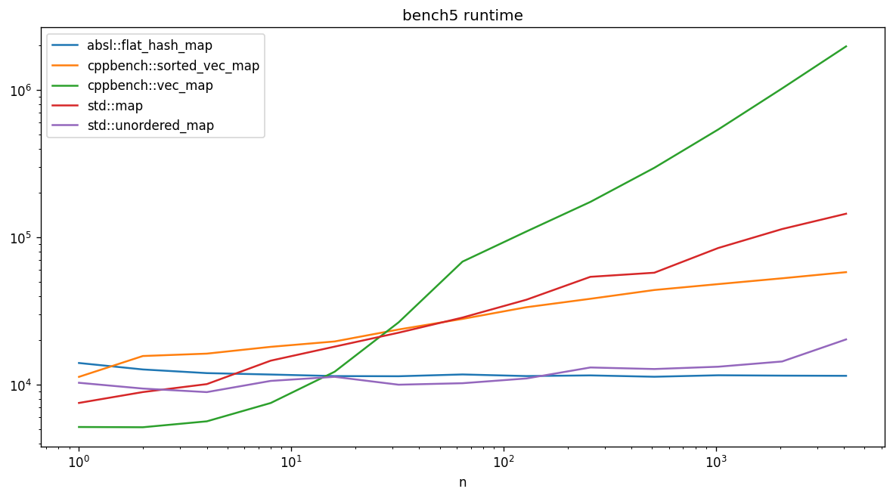
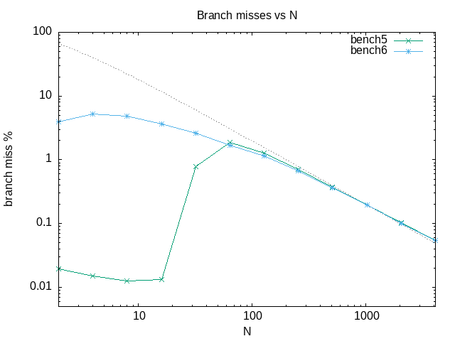
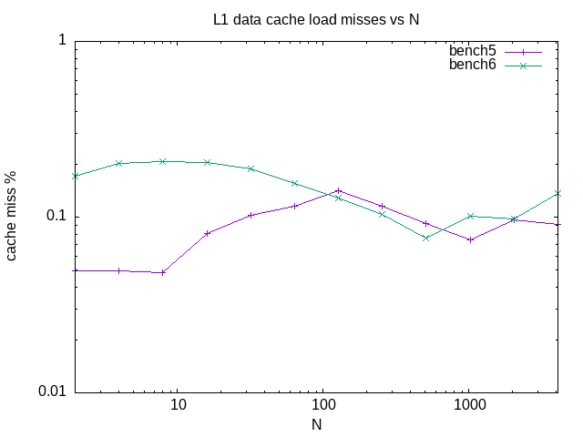

# C++ Benchmarking

[](https://opensource.org/licenses/MIT)
[](https://github.com/ssciwr/cpp-benchmarking/actions?query=workflow%3ACI)
[](https://codecov.io/gh/ssciwr/cpp-benchmarking)

We use C++ to get good performance, so measuring and understanding the performance
characteristics of our code is vital, for example to identify bottlenecks or to determine if a
change to the code actually improves the performance. Unfortunately it is also complicated. In
this course we will cover three different ways to benchmark our code, and discuss the pros and
cons of each method.

## Slides

<iframe src="https://docs.google.com/presentation/d/e/2PACX-1vSfJG2SPALpfAuDUZ9skpvYSEkqCMYGZIY3scXCpHttpSpjZ_fr225hVFOLCN2Y4wqN94mwuhPipez5/embed?start=false&loop=false&delayms=3000" frameborder="0" width="960" height="569" allowfullscreen="true" mozallowfullscreen="true" webkitallowfullscreen="true"></iframe>

[download slides as pdf](https://github.com/ssciwr/cpp-benchmarking/raw/main/slides/slides.pdf) | [download course description as pdf](https://ssc.iwr.uni-heidelberg.de/sites/default/files/ssc-benchmarking.pdf)

## Getting started

To clone the repo and compile the code:

```
git clone --recursive https://github.com/ssciwr/cpp-benchmarking.git
cd cpp-benchmarking
mkdir build
cd build
cmake -DCMAKE_BUILD_TYPE=Release ..
cmake --build .
```

This code contains two very simple map implementations,
[vec_map](https://github.com/ssciwr/cpp-benchmarking/blob/main/include/cppbench/vec_map.hpp) and [sorted_vec_map](https://github.com/ssciwr/cpp-benchmarking/blob/main/include/cppbench/sorted_vec_map.hpp),
along with benchmarks of these and other map implementations.

## Micro-benchmarks

- [bench](https://github.com/ssciwr/cpp-benchmarking/blob/main/bench) contains some micro-benchmarks using the [Google Benchmark](https://github.com/google/benchmark) library
- [plots](https://github.com/ssciwr/cpp-benchmarking/blob/main/plots) contains some sample output & plots of these benchmarks and a simple Python script to make the plots



## Profiling

- [perf](perf) contains some scripts and plots using perf to profile performance




## Simulation


## Acknowledgements

This repo was quickly set up using the SSC [C++ Project Cookiecutter](https://github.com/ssciwr/cookiecutter-cpp-project).
